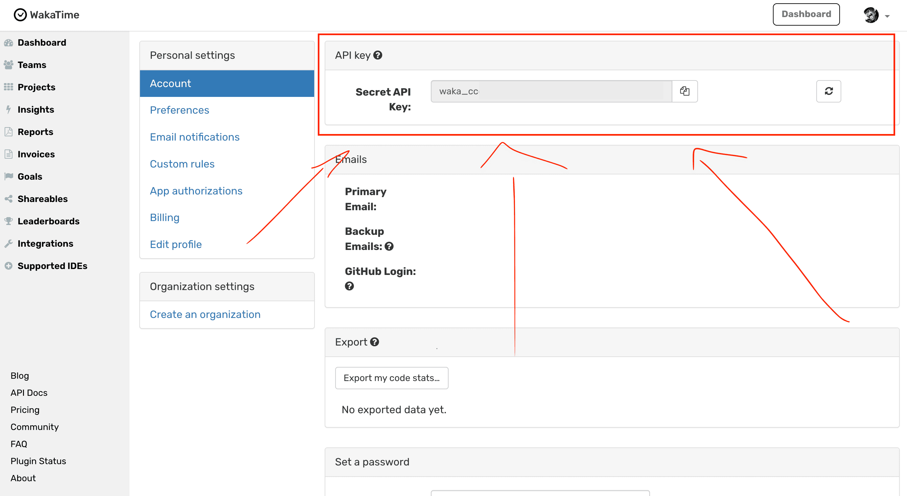

# NiciWaka

Telegram бот для отслеживания статистики кодирования участников с помощью WakaTime API.

## Функциональность

- Автоматическая регистрация пользователей через интерфейс бота
- Интеграция с WakaTime API для получения статистики кодирования
- Отображение ежедневных топов по времени кодирования
- Отображение еженедельных топов по времени кодирования

## Команды бота

- `/start` - начать процесс регистрации
- `/register` - повторная регистрация или обновление API ключа
- `/top` - показать топ пользователей по времени кодинга за сегодня
- `/week` - показать топ пользователей по времени кодинга за неделю

## Как получить WakaTime API ключ

1. Перейдите на страницу настроек аккаунта WakaTime: [https://wakatime.com/settings/account](https://wakatime.com/settings/account)
2. Прокрутите вниз до раздела "API Key"
3. Скопируйте ваш API ключ



## Процесс регистрации

1. Пользователь отправляет команду `/start`
2. Бот запрашивает контакт пользователя
3. После получения контакта бот запрашивает WakaTime API ключ
4. Пользователь отправляет свой API ключ
5. Регистрация завершается и пользователь может использовать команды `/top` и `/week`

## Требования для запуска

- Python 3.7+
- PostgreSQL
- Telegram Bot API Token
- WakaTime API доступ

## Установка и запуск

1. Клонировать репозиторий
2. Установить зависимости: `pip install -r requirements.txt`
3. Создать файл `.env` с переменными окружения:
   ```
   TELEGRAM_BOT_TOKEN=ваш_токен_бота
   DATABASE_URL=postgresql://пользователь:пароль@хост:порт/имя_базы
   ```
4. Запустить бота: `python main.py`

## Docker

Для запуска с использованием Docker:

```
docker-compose up -d
```
